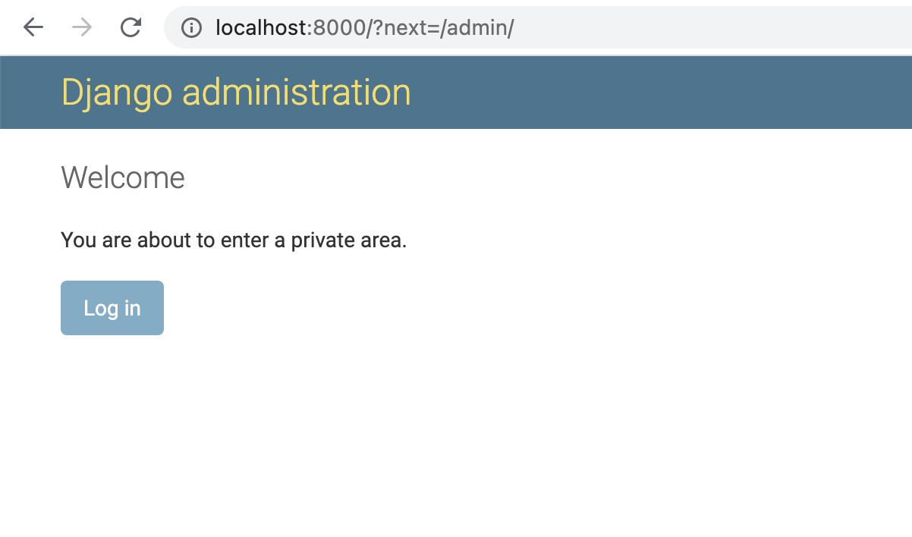

# Django Frontpage

Show a page before your users authenticate into the admin site.

[](https://travis-ci.org/Microdisseny/django-frontpage) [](https://coveralls.io/github/Microdisseny/django-frontpage?branch=master) [](https://badge.fury.io/py/django-frontpage)

Valid users will go straight to the admin site, others will land in the frontpage
where you can show an app description, warning, etc. You only need to provide
your own template.

After clicking the login button in the frontpage, the user will be redirected to the
original url. If there was no original url, the user will be redirected to the
`FRONTPAGE_ADMIN_PREFIX`.


## Getting started

Works with Django version 2.0 to 3.1.

Tested with Django-supported Python versions.

Install:

```
pip install django-frontpage
```

Then modify your Django settings:

Add the `frontpage` application to `INSTALLED_APPS`:

```python
INSTALLED_APPS = (
  ...
  'frontpage',
  ...
)
```

Add the middleware to `MIDDLEWARE` after `AuthenticationMiddleware` or any
other authentication middleware like OAuth2:

```python
MIDDLEWARE = [
    ...
    'django.contrib.auth.middleware.AuthenticationMiddleware',
    'oauth2_provider.backends.OAuth2Backend',
    'frontpage.middleware.FrontpageMiddleware',
    ...
]
```

Default admin prefix is `'/admin/'` change it if necessary:

```python
FRONTPAGE_ADMIN_PREFIX = '/admin/'
```

Add the frontpage view to your urls:

```python
from frontpage.views import FrontpageView

urlpatterns = [
    path('', FrontpageView.as_view(), name='frontpage'),
    path('admin/', admin.site.urls),
    ...
]
```

## Demo

Here's how the default template looks like:




## Custom frontpage template

Place a different frontpage template in `frontpage/index.html`.

Or use the `template_name` attribute in `urls.py`:

```python
from frontpage.views import FrontpageView

urlpatterns = [
    path('', FrontpageView.as_view(template_name='my_frontpage.html'), name='frontpage'),
    path('admin/', admin.site.urls),
    ...
]
```

See [frontpage/templates/frontpage/index.html](frontpage/templates/frontpage/index.html) for the default frontpage template.


## Settings

| Option                        | Default        | Description                             |
|-------------------------------|----------------|-----------------------------------------|
| **`FRONTPAGE_ADMIN_PREFIX`**  | '/admin/'      | mandatory, the path of the admin site.  |
| `FRONTPAGE_URL_NAME`          | 'frontpage'    | name of the frontpage url               |
| `FRONTPAGE_LOGIN_URL_NAME`    | 'admin:login'  | name of the login url                   |
| `FRONTPAGE_LOGOUT_URL_NAME`   | 'admin:logout' | name of the logout url                  |
| `FRONTPAGE_RELOGIN_URL_NAME`  | 'admin:login'  | name of the relogin url                 |

Frontpage needs to know about the logout url because that one should not be redirected.

Relogin is necessary if you are logged in as an user that does not have access to the admin.
You may need to implement a custom view to logout the user then redirect to some login URL.


## Flow

When the `frontpage` is accessed then:
- if the user `is_authenticated` and `is_staff` then:
  - the user will be redirected to the `admin` site
- if the user `is_authenticated` but NOT `is_staff` then:
  - `frontpage` is rendered with a specific message
- if the user is anonymous then:
  - `frontpage` is rendered with a specific message

When any page of the `admin` site is accessed then:
- if the user `is_authenticated` and `is_staff` then:
  - everything is ok, `frontpage` will do nothing here
- if the user `is_authenticated` but NOT `is_staff` then:
  - the user will be redirected to the `frontpage` page
- if the user is anonymous then:
  - the user will be redirected to the `frontpage` page


## Tests

```
pip install -r requirements-dev.txt
pip install Django
pytest
```

## Authors

[](http://www.microdisseny.com/)
